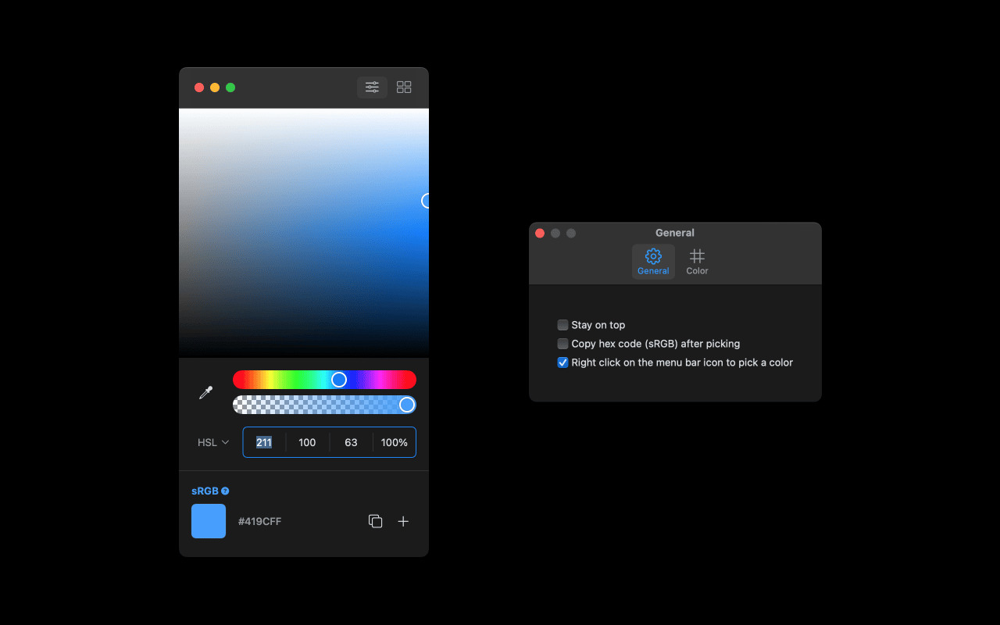
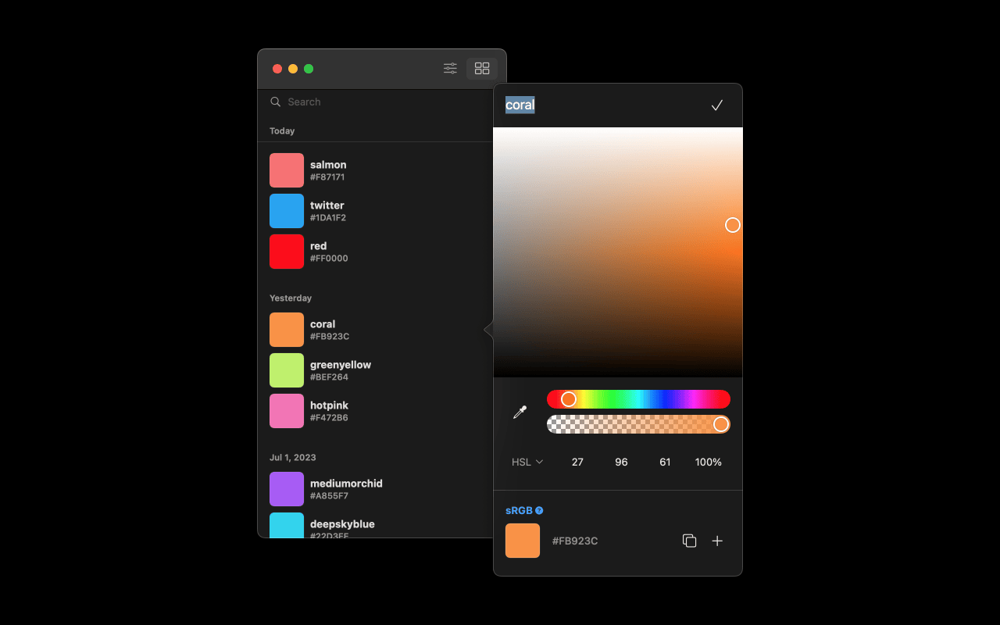

# Solid

> Color picker app for macOS inspired by Figma.

# Features

- Pick a color on screen on paste from clipboard.
- Supports RGB, HSB, and HSL color models.
- Save and edit.
- Search.

# Thanks

- [Josh Comeau](https://twitter.com/joshwcomeau) for the [HSL color picker implementation](https://www.joshwcomeau.com/css/color-formats/#hsl-4)
- [Sindre Sorhus](https://twitter.com/sindresorhus) for making [System-Color-Picker](https://github.com/sindresorhus/System-Color-Picker), which inspired some of the features in this app.
